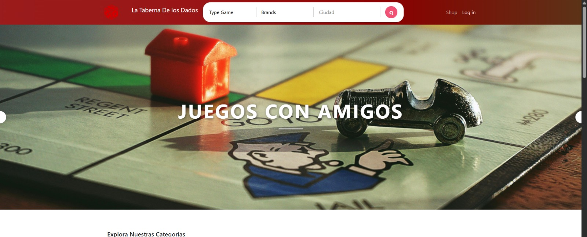
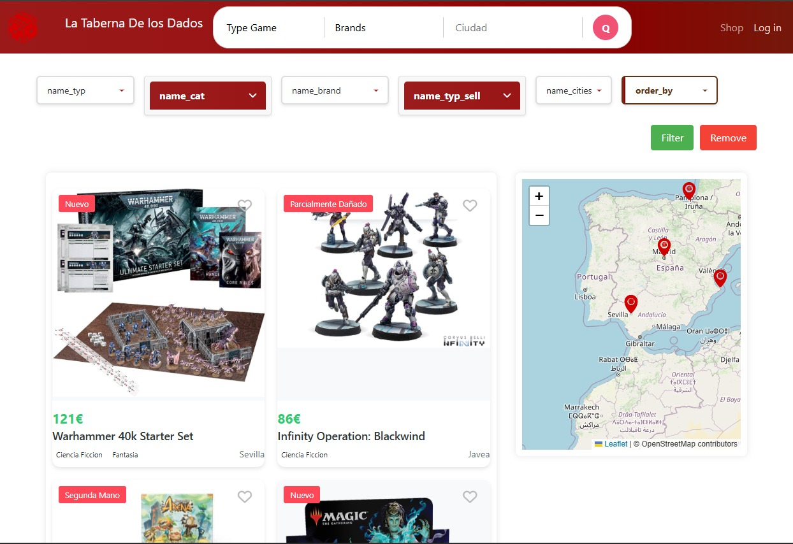
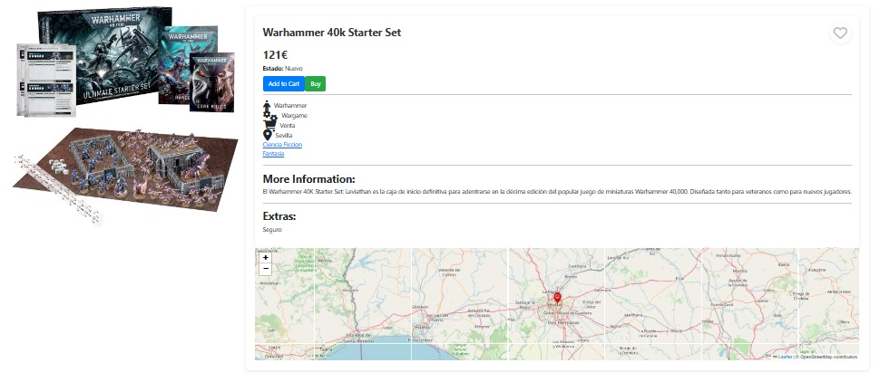
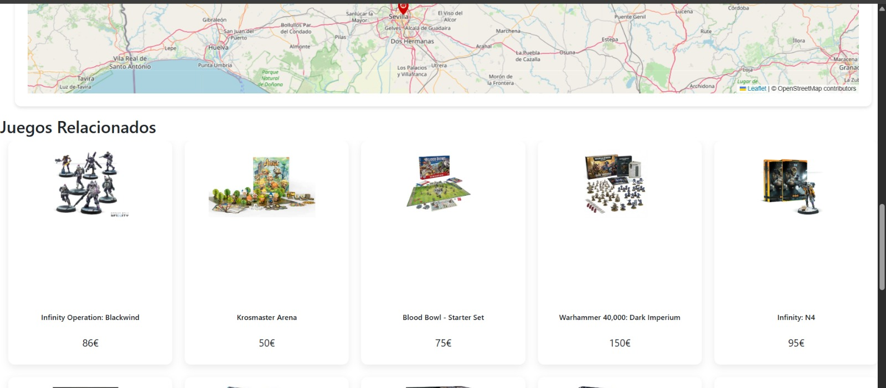
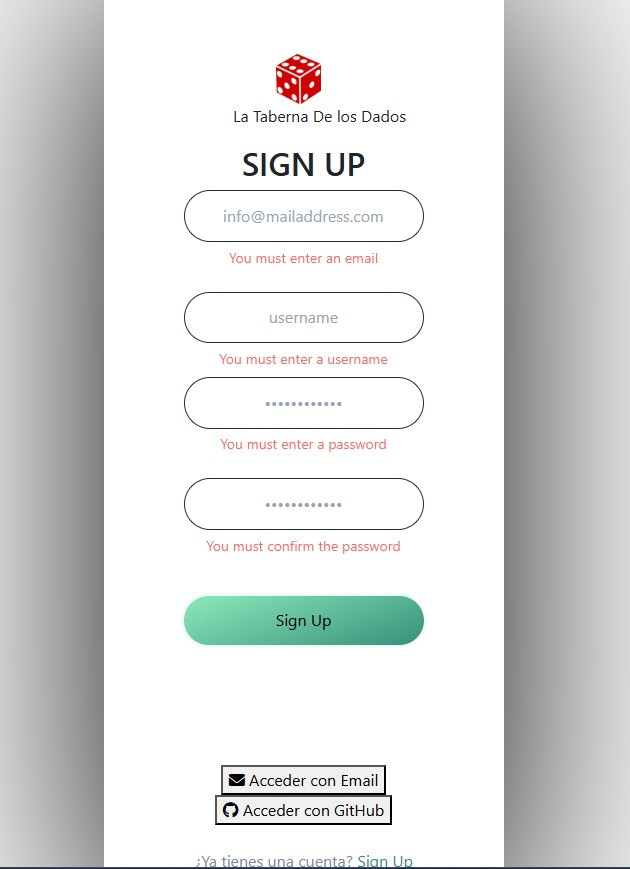
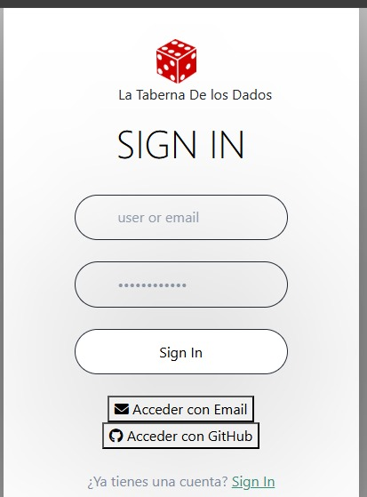
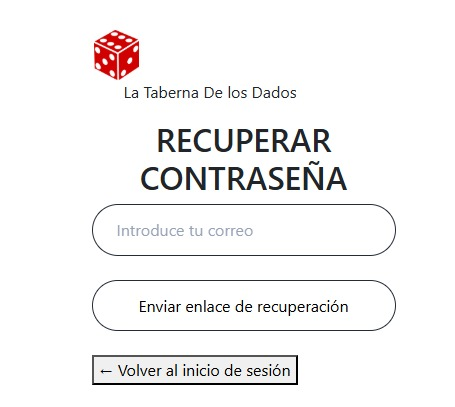
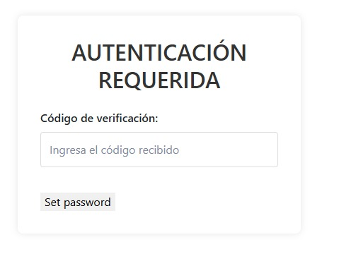
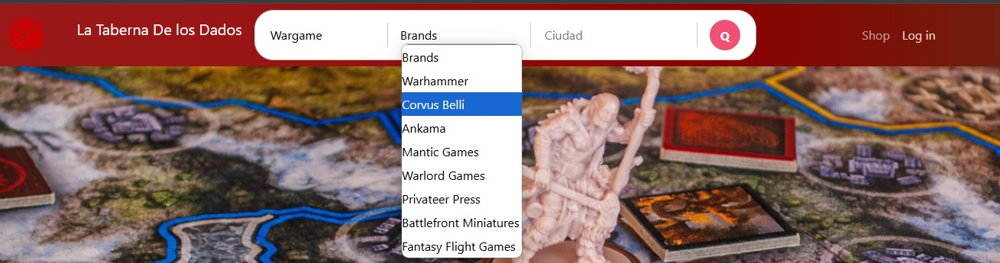

# ♻️ WarGames Bazaar 🎲

|  |
|:--:|
| _Bienvenida a la taberna de los dados, el portal de entrada a la comunidad._ |

---

<p align="center">
  
  
  
  
</p>

---

## ✨ Bienvenido a **WarGames Bazaar** ✨

¡Tu tienda digital de segunda mano para juegos de mesa, especializada en el emocionante mundo de los **wargames**!  
Plataforma amigable y profesional para comprar y vender tus juegos favoritos, con un enfoque en la comunidad y la pasión por el hobby.

---

## 🏗️ Estructura General del Proyecto

El proyecto está dividido en **capas funcionales** para facilitar la escalabilidad y el mantenimiento.  
Cada sección incluye un resumen, las tecnologías principales y recomendaciones visuales.

---

### 📐 Arquitectura y organización

```mermaid
flowchart LR
    Index --> Router
    Router --> Module
    Module --> Shop (View/Top_page)
    Module --> Home (View/Top_page)
    Module --> Search (View/Top_page)
    Module --> Auth (View/Top_page)
    Shop & Home & Search & Auth --> Controller (Jv)
    Controller (Jv) --> BLL_class
    BLL_class --> DAO_class
    DAO_class --> Servidor
```

---

## 🏠 Home

|  |
|:--:|
| _Dashboard de inicio con bienvenida y acceso a funcionalidades principales._ |

### Funcionalidades Principales

- 🎉 **Presentación general** de la tienda y su especialización en juegos de mesa wargames.
- 💎 **Diseño amigable y responsivo** para todo tipo de dispositivos.
- 🚀 **Acceso rápido** a Shop y Login.
- 🎠 **Carruseles dinámicos** de tipos, categorías, marcas, ciudades y productos más gustados/visitados.
- ⚡ **Navegación dinámica**: salto sencillo del Home al Shop aplicando filtros automáticos o accediendo rápidamente a un producto.

#### 🛠️ Tecnologías
- **Frontend:** HTML, JavaScript, CSS3 (Tailwind, Bootstrap, etc.)
- **Backend:** PHP, Java

> 📝 *La página de inicio facilita la exploración y el acceso a los productos más relevantes, ofreciendo una experiencia moderna y eficiente desde el primer momento.*

---

## 🛒 Shop

### Vista general de la tienda

|  |
|:--:|
| _Vista principal de la tienda: productos destacados, datacards y navegación._ |

**Funcionalidades principales:**
- 🃏 **Catálogo** de juegos de segunda mano, visualización clara y ordenada.
- 🗂️ **Filtros avanzados** por tipo, categoría, ciudad, marca, etc.
- 🔍 **Detalle de producto**: página específica con fotos y descripciones.
- 🗺️ **Geolocalización**: mapa interactivo personalizado para localizar productos cercanos.
- 🔄 **Paginación eficiente**: 8 productos por página.
- ⚙️ **Filtros dinámicos**: adaptados a los modelos de la base de datos, sin perder filtros tras cada búsqueda.

---

### Vista de detalle de producto

|  |
|:--:|
| _Vista específica de un producto._ |

**Funcionalidades destacadas:**
- 🚀 **Acceso rápido a filtros**: aplicar categorías del producto como filtros en la tienda.
- 🗺️ **Geolocalización individual** del producto en el mapa.
- 🔗 **Navegación a productos relacionados** por tipo y categoría.

---

### Vista de productos relacionados

|  |
|:--:|
| _Listado de productos relacionados._ |

#### 🛠️ Tecnologías
- **Frontend:** HTML / CSS / JavaScript
- **Backend/API:** PHP / Java
- **Base de datos:** MySQL
- **Mapas:** Leaflet

> 📝 *El sistema de Shop es flexible y escalable, permitiendo incorporar nuevos filtros y funcionalidades fácilmente según crezcan las necesidades de la tienda.*

---

## 🔐 Login & Registro

### Registro de usuario

|  |
|:--:|
| _Formulario para registrar nuevos usuarios._ |

### Acceso/Login

|  |
|:--:|
| _Formulario de acceso para usuarios registrados._ |

### Recuperación/Cambio de contraseña

|  |
|:--:|
| _Formulario seguro para recuperar o cambiar la contraseña mediante validación por email._ |

### Desbloqueo de cuenta/desbaneo

|  |
|:--:|
| _Formulario para desbloquear la cuenta tras intentos de acceso no autorizados, incluye verificación adicional._ |

**Funcionalidades principales**
- **Autenticación** sencilla y segura.
- Formularios de login y registro con validaciones amigables.
- Recuperación y cambio de contraseña vía email (API Resend).
- Desbloqueo de cuenta tras intentos sospechosos (Telegram).
- Gestión de sesiones (cookies, JWT, etc.).
- Autenticación en dos pasos (2FA).
- Login social con Firebase.

#### 🛠️ Tecnologías
- **Frontend:** HTML / CSS / JavaScript
- **Backend:** PHP / Java
- **Autenticación:** JWT, cookies, Firebase Auth
- **APIs externas:** Resend (email), Telegram Bot API, Firebase
- **Base de datos:** MySQL

> 📝 *El sistema de autenticación combina seguridad, usabilidad y flexibilidad, integrando múltiples métodos modernos y servicios externos.*

---

## 🔎 Search

|  |
|:--:|
| _Buscador avanzado con filtros dependientes para juegos de mesa._ |

**Funcionalidades principales**
- **Filtros dinámicos y dependientes**:
  - **Type** (tipo de juego): selector desplegable.
  - **Brand** (marca/editorial): selector desplegable dependiente del tipo.
  - **Ciudad**: campo de texto.
- **Lógica secuencial**:  
  `Type → Brand → Ciudad`. Cada filtro aplicado condiciona las opciones del siguiente.
- Combinación flexible:  
  - Si solo se selecciona **Type**, muestra marcas y productos de ese tipo.
  - Si solo **Brand**, todos los productos de esa marca.
  - Si solo **Ciudad**, todos los productos en esa ciudad.
  - Combinación progresiva de filtros para búsquedas específicas.
- **UX avanzada**: solo se muestran opciones válidas en cada paso, evitando resultados vacíos y facilitando la búsqueda.

#### 🛠️ Tecnologías
- **Frontend:** HTML / CSS / JavaScript
- **Backend/API:** PHP / Java
- **Base de datos:** MySQL

> 📝 *El buscador avanzado adapta dinámicamente las opciones de filtrado, optimizando la búsqueda de juegos de mesa en la plataforma.*

---

## 🔌 APIs externas utilizadas

- **Resend API**  
  Para verificación de correo electrónico, recuperación y cambio de contraseña.
- **Telegram Bot API**  
  Para notificaciones de seguridad y desbloqueo de cuentas tras intentos de acceso sospechosos.
- **Firebase Auth API**  
  Para login social seguro con correo electrónico.
- **Leaflet API**  
  Para mapas interactivos y geolocalización de productos.

---

## 🔒 Seguridad y configuración

- Toda la información sensible referente a claves de API y credenciales privadas (Firebase, Resend, Telegram, etc.) se almacena en archivos `.ini` fuera del directorio público.
- Estos `.ini` contienen la configuración y credenciales necesarias para la conexión segura con los servicios externos, y deben mantenerse fuera del control de versiones.

---

## 🚀 ¡Disfruta programando y compartiendo tu pasión por los Wargames!

¿Dudas? ¿Sugerencias? Abre un issue o contacta con el equipo responsable.

---