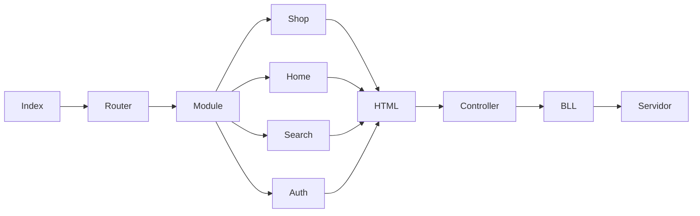

# ♻️ WarGames Bazaar 🎲

|  |

---

  
  
  
  

---

## ✨ Bienvenido a **WarGames Bazaar** ✨

<!-- [Aquí puedes poner una imagen del dashboard de la Home o una captura principal de la web. Ejemplo:  
 ] -->

¡Tu tienda digital de segunda mano para juegos de mesa, especializada en el emocionante mundo de los **wargames**!  
Aquí encontrarás una plataforma amigable y profesional para comprar y vender tus juegos favoritos, con un enfoque en la comunidad y la pasión por el hobby.

---

## 🏗️ Estructura General del Proyecto

El proyecto está dividido en **capas funcionales**, siguiendo el flujo de desarrollo y facilitando la escalabilidad y el mantenimiento.  
Cada sección incluye un resumen, las tecnologías principales y recomendaciones visuales de dónde añadir imágenes para una mejor presentación.

---

### 🏠 Home

|  |
|:--:|
| _Aquí una imagen del dashboard o portada de la home, mostrando la bienvenida y acceso a funcionalidades principales._ |

---

#### Funcionalidades Principales

- 🎉 **Presentación general** de la tienda y su especialización en juegos de mesa wargames.
- 💎 **Diseño amigable y responsivo** para todo tipo de dispositivos.
- 🚀 **Acceso rápido** a las secciones de Shop y Login.
- 🎠 **Carruseles dinámicos** de:
  - Tipos de juegos
  - Categorías
  - Marcas
  - Ciudades
  - Productos más gustados y más visitados  
  *(Estos carruseles permiten navegar fácilmente y aplicar filtros en el Shop, creando una conexión directa entre Home y Shop para acceder rápidamente al producto deseado o explorar por preferencias).*
- ⚡ **Navegación dinámica**: salto sencillo y rápido desde el Home al Shop aplicando filtros automáticos o viajando directamente a la ficha del producto.

---

#### 🛠️ Tecnologías empleadas
- **Frontend:** HTML, JavaScript
- **Backend:** PHP, Java
- **Estilos:** CSS3, (añade aquí si usas Tailwind, Bootstrap, etc.)

---

> 📝 *La página de inicio está pensada para facilitar la exploración y el acceso a los productos más relevantes, ofreciendo una experiencia moderna y eficiente a los usuarios desde el primer momento.*

### 🛒 Shop

|  |
|:--:|
| _Vista principal de la tienda: productos destacados, datacards y navegación._ |

---

#### Funcionalidades Principales

- 🃏 **Catálogo de juegos** de segunda mano, visualización clara y ordenada.
- 🗂️ **Filtros avanzados** por tipo, precio, editor, estado, etc.
- 💳 **Carrito de compra** básico (si aplica).
- 🔍 **Detalle de producto**: página específica con fotos y descripciones.
- 🗺️ **Sistema de geolocalización**: mapa interactivo personalizado con el logo de la empresa para localizar productos cerca del usuario.
- 🔄 **Paginación eficiente**: muestra 8 productos por página para mejor experiencia.
- ⚙️ **Filtros dinámicos**: el sistema de filtros se adapta automáticamente a los modelos configurados en la base de datos, actualizando la vista sin perder los filtros aplicados tras cada búsqueda.

---

#### 🛠️ Tecnologías empleadas
- **Frontend:** HTML / CSS / JavaScript
- **Backend/API:** PHP / Java
- **Base de datos:** MySQL
- **Mapas:** Leafle

---

> 📝 *El sistema de Shop está diseñado para ser flexible y escalable, permitiendo incorporar nuevos tipos de filtros y funcionalidades fácilmente según crezcan las necesidades de la tienda.*

### 🔐 Login

<!-- [Aquí imagen del formulario de login, con algún detalle visual. Ejemplo:  
 ] -->

- **Autenticación de usuarios** sencilla y segura.
- Formulario de login con validaciones amigables.
- Gestión de sesiones (con cookies, JWT, etc.).
- **Tecnologías:**  
  - Frontend: React/Vue/Angular
  - Backend: Node.js/Express, etc.
  - Autenticación: JWT, OAuth, etc.

---

## 📦 Organización Recomendada

- **Documentación clara**: Mantén este README y tu documentación técnica actualizados.
- **Buenas prácticas**: Nombra ramas y commits de forma descriptiva, sigue convenciones de código y comenta en las zonas clave.
- **Escalabilidad**: Usa patrones de diseño y separación por capas para facilitar futuras mejoras.

---

## 🎨 Ejemplo visual de arquitectura y organización

---

## 🚀 ¡Disfruta programando y compartiendo tu pasión por los Wargames!

¿Dudas? ¿Sugerencias? Abre un issue o contacta con el equipo responsable.

---
